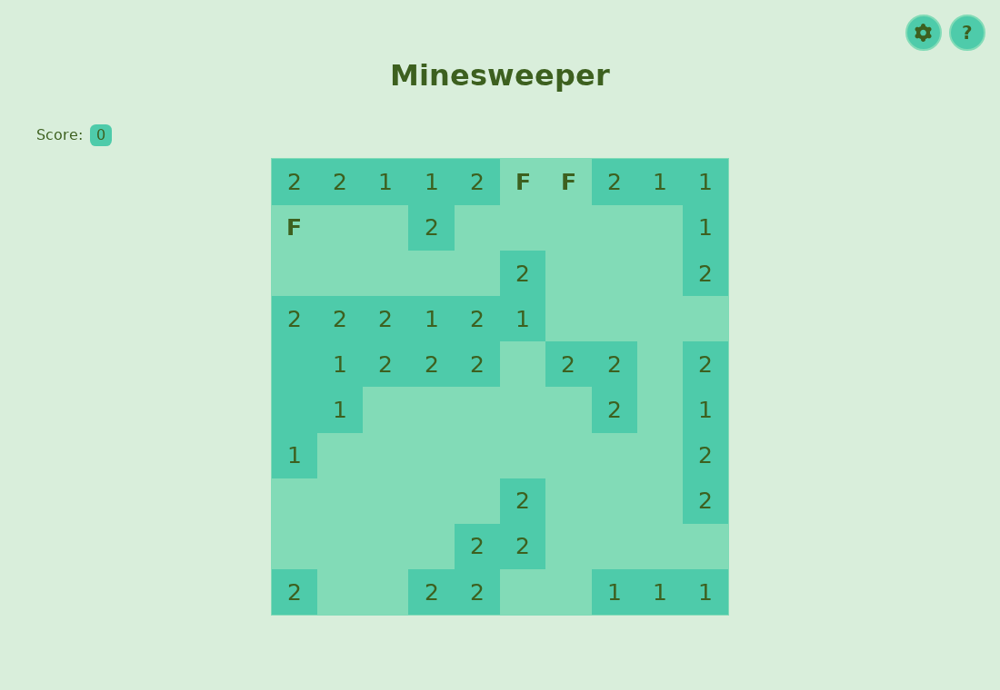

# minesweeper-javascript
The classic Minesweeper game, made in JavaScript.

**[Play it live](https://donatellodonini.github.io/minesweeper-javascript/)**

<picture>
  <source media="(prefers-color-scheme: dark)" srcset="assets/screenshot-dark.png">
  
</picture>

## Features
- **Three difficulties**: easy (10x10), medium (15x15) and hard (20x20), switchable from the settings button. The choice is remembered by the browser.
- **A new color palette every game**: five harmonious colors are generated at load, sorted by brightness and mapped to the page theme. The order flips when the browser is in dark mode, and follows it live when the theme changes.
- **Always a square board**: the field sizes itself to the largest square that fits the screen, from small phones to 1440p monitors, without scrolling to reach the replay button.
- **In-game rules**: the `?` button opens a panel explaining how to play.

## How to play
- **Left click** a covered cell to dig it.
- **Right click** a covered cell to plant a flag where you think a bomb is.
- Numbers tell how many bombs touch a cell, diagonals included.
- Dig every covered safe cell to win, dig a bomb and it's game over.

## Under the hood
Plain JavaScript (ES modules), HTML and CSS: no frameworks, no dependencies, no build step.

The UI is made of small reusable components (`GameBoard`, `ScoreBoard`, `ModalMessage`, `RulesButton`, `SettingsButton`). Each one works on its own with neutral black and white defaults and receives its colors, position and content from `index.js`, which wires them together.

| File | Role |
| --- | --- |
| `index.js` | Entry point: builds the page, the game settings and the rules |
| `GameBoard.js` | The field: cells, bombs, digging, flags, victory and game over |
| `Palette.js` | Random palette generation and light/dark theme mapping |
| `ScoreBoard.js` | The score counter |
| `ModalMessage.js` | The victory/game over message |
| `RulesButton.js`, `SettingsButton.js` | The `?` and settings buttons with their panels |
| `utils.js` | Small DOM helpers |

## Run it locally
The game uses ES modules, so it has to be served over HTTP rather than opened as a file:

```bash
git clone https://github.com/DonatelloDonini/minesweeper-javascript.git
cd minesweeper-javascript
python3 -m http.server 8000
```

Then open http://localhost:8000.
